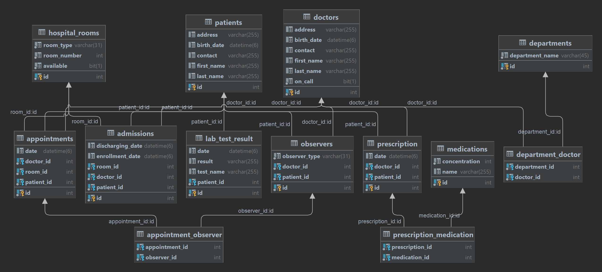

# Hospital  Management Project
#
### Spring Boot with IntelliJ IDEA, MySQL, JPA, Hibernate, Thymeleaf and Bootstrap

## Design Patterns:
#
### Observer Pattern
##
#### Observable: Appointment
#### Observers implement the AppointmentObserver interface

    public interface AppointmentObserver {
    void update(Appointment appointment);
    }

#### Observer: DoctorDashboard (Attribute: Doctor)
    @Override
    public void update(Appointment appointment) {
        ArrayList<Appointment> appointments = super.getAppointments();
        appointments.add(appointment);
        super.setAppointments(appointments);
        System.out.println(doctor.getFirstName() + " " + doctor.getLastName() + " - Latest update: " + appointment);
    }
#### Observer: PatientNotificationSystem (Attribute: Patient)
    @Override
    public void update(Appointment appointment) {
        ArrayList<Appointment> appointments = super.getAppointments();
        appointments.add(appointment);
        super.setAppointments(appointments);
        System.out.println(patient.getFirstName()+" " + patient.getLastName() + " - Latest appointment update: " + appointment);
    }

##
### Builder Pattern
#### LabTestResultBuilder - nested class of LabTestResult
    public static class LabTestResultBuilder {
        private Patient patient;
        private String testName;
        private LocalDateTime date;
        private String result;

        public LabTestResultBuilder withPatient(Patient patient) {
            this.patient = patient;
            return this;
        }

        public LabTestResultBuilder withTestName(String testName) {
            this.testName = testName;
            return this;
        }

        public LabTestResultBuilder withTestDate(LocalDateTime testDate) {
            this.date = testDate;
            return this;
        }

        public LabTestResultBuilder withResult(String result) {
            this.result = result;
            return this;
        }

        public LabTestResult build() {
            LabTestResult labTestResult = new LabTestResult();
            labTestResult.patient = this.patient;
            labTestResult.testName = this.testName;
            labTestResult.date = this.date;
            labTestResult.result = this.result;
            return labTestResult;
        }
    }
##### Creating LabTestResult
      LabTestResult labTestResult = new LabTestResult.LabTestResultBuilder()
      .withPatient(patient)
      .withTestName(name)
      .withTestDate(date)
      .withResult(result)
      .build();

### Decorator Pattern
#### Billing Interface:

- Billing: An interface defining a method calculateCost() that returns a double representing the cost.
#
      public interface Billing {
         double calculateCost();
      }

#### Concrete Component:
  - BasicBilling
    - A concrete class that implements the Billing interface, providing a basic implementation of calculateCost().
#
      public class BasicBilling implements Billing {
      @Override
      public double calculateCost() {
      return 100.0;
      }
      }
#### Decorator:

##### BillingDecorator
   - An abstract class implementing the Billing interface. It contains a reference to a Billing object and provides a default implementation for calculateCost() that delegates the calculation to the decorated billing object.
#

      public abstract class BillingDecorator implements Billing {
          protected Billing decoratedBilling;
      
          public BillingDecorator(Billing decoratedBilling) {
              this.decoratedBilling = decoratedBilling;
          }
      
          @Override
          public double calculateCost() {
              return decoratedBilling.calculateCost();
       }
      }

#### Concrete Decorators:
##### ConsultationFeeDecorator
   - Extends BillingDecorator and adds additional behavior by introducing a consultation fee to the basic cost.
#
      public class ConsultationFeeDecorator extends BillingDecorator {
      public ConsultationFeeDecorator(Billing decoratedBilling) {
      super(decoratedBilling);
      }
      
          @Override
          public double calculateCost() {
              // Additional feature: Add consultation fee
              double basicCost = super.calculateCost();
              double consultationFee = 50.0;
              return basicCost + consultationFee;
          }
      }
##### TestFeeDecorator
   - Extends BillingDecorator and adds additional behavior by introducing a test fee to the basic cost.
#
      public class TestFeeDecorator extends BillingDecorator {
      public TestFeeDecorator(Billing decoratedBilling) {
      super(decoratedBilling);
      }
      
          @Override
          public double calculateCost() {
              double basicCost = super.calculateCost();
              double testFee = 30.0;
              return basicCost + testFee;
          }
      }
####  Hospital Billing System
- Return the cost of an appointment/ of a lab test
- The billing system employs the Decorator Pattern to extend the functionality of the basic billing process by adding additional fees through decorator classes.
#### - Methods
    public double patientAppointmentBill(){
        Billing billingWithConsultation = new ConsultationFeeDecorator(new BasicBilling());
        return billingWithConsultation.calculateCost();
    }
    public double patientTestsBill(){
        Billing billingWithTest = new TestFeeDecorator(new BasicBilling());
        return billingWithTest.calculateCost();
    }
### Factory Pattern
###
#### HospitalRoomFactory
- ExaminationRoom and AdmissionRoom inherit from HospitalRoom
- taking into consideration the desired room type a new instance of Examination/Admission Room will be created
###
    public HospitalRoom createHospitalRoom(String roomType) {
        if ("examination".equalsIgnoreCase(roomType)) {
            return new ExaminationRoom();
        } else if ("admission".equalsIgnoreCase(roomType)) {
            return new AdmissionRoom();
        } else {
            // Handle unknown room types or throw an exception
            throw new IllegalArgumentException("Invalid room type: " + roomType);
        }
    }
### Singleton Pattern
#### Emergency Room
##### EmergencyRoom Class
    private static EmergencyRoom instance;
    private List<Doctor> doctorsOnCall;
    private List<PatientInfo> waitingList;

    private EmergencyRoom() {
        waitingList = new ArrayList<>();
        doctorsOnCall = new ArrayList<>();
    }
    public static EmergencyRoom getInstance() {
        if (instance == null) {
            instance = new EmergencyRoom();
        }
        return instance;
    }
##### EmergencyRoomService
    private EmergencyRoom emergencyRoom;

    @PostConstruct
    public void initialize() {
        emergencyRoom = EmergencyRoom.getInstance();
        emergencyRoom.resetWaitingList();
        emergencyRoom.setDoctorsOnCall(doctorService.listOnCall());
    }
### Strategy Pattern

 - In the emergency room patients will be handled accordingly to the severity of their condition
 - Possible states: CRITICAL / STABLE / SERIOUS
 - Treatment in the emergency room is administered in order of priority, with the severity of the patient's condition guiding the allocation of resources.

#### PatientHandlingStrategy interface
    public interface PatientHandlingStrategy {
    void handlePatient(Patient patient, Doctor doctor);
    }
#### Classes implementing the interface
##### CriticalConditionStrategy - the doctor will admit the patient
    @Override
    public void handlePatient(Patient patient, Doctor doctor) {
        System.out.println("Doctor" +  doctor + " Admitting patient " + patient + " with CRITICAL/SERIOUS condition.");
    }
##### NonCriticalConditionStrategy - the doctor will write a prescription
    @Override
    public void handlePatient(Patient patient, Doctor doctor) {
        System.out.println("Doctor: "+doctor+" Writing prescription for patient: " + patient+ " with NON-CRITICAL condition.");
    }
#### EmergencyRoom Class 
    private PatientHandlingStrategy strategy;
    private List<Doctor> doctorsOnCall;
    private List<PatientInfo> waitingList;
 - Every time the EmergencyRoomService is called:
   -    The waiting list of the Emergency Room will be set to an empty list
   -    The on call doctors list will be updated with the doctors that are on call at that moment
 - When adding a new patient to the waiting list, the waiting list will be sorted after the patients state
 - When handling a new patient, a doctor that is on call will be assigned to the case
 -     public Doctor assignDoctor() {
        Random random = new Random();

        int randomIndex = random.nextInt(doctorsOnCall.size());

        return doctorsOnCall.get(randomIndex);}
   - If the patients state is Critical / Serious, the strategy will be set to
     CriticalConditionStrategy
   - Else the strategy will be set to NonCriticalConditionStrategy
##

        if (patientCondition == PatientCondition.CRITICAL || patientCondition == PatientCondition.SERIOUS) {
            Admission admission = new Admission(patient, assignedDoctor, date);
            AdmissionRoom admissionRoom = (AdmissionRoom) hospitalRoomService.firstAvailableAdmissionRoom();
            admission.setAdmissionRoom(admissionRoom);
            admissionService.save(admission);
            setStrategy(new CriticalConditionStrategy());
        } else if (patientCondition == PatientCondition.STABLE) {
                Prescription prescription = new Prescription(assignedDoctor, patient, date);
                List<Medication> medications = new ArrayList<>();
                prescription.setMedications(medications);
                prescriptionService.save(prescription);
        setStrategy(new NonCriticalConditionStrategy());
        }
        strategy.handlePatient(patient, assignedDoctor);

## Entities:

###  Patients
####  - Attributes
    private String firstName
    private String lastName
    @DateTimeFormat(pattern = "yyyy-MM-dd'T'HH:mm")
    private LocalDateTime birthDate
    private String contact
    private String address
####  - Relationships
    @OneToMany(mappedBy = "patient", fetch = FetchType.LAZY, cascade = CascadeType.ALL)
    private List<Appointment> appointments;
    @OneToMany(mappedBy = "patient", fetch = FetchType.LAZY, cascade = CascadeType.ALL)
    private List<Admission> admissions;

    @OneToMany(mappedBy = "patient", fetch = FetchType.LAZY, cascade = CascadeType.ALL)
    private List<PatientNotificationSystem> patientNotificationSystems;

    @OneToMany(mappedBy = "patient", fetch = FetchType.LAZY, cascade = CascadeType.ALL)
    private List<Prescription> prescriptions;

    @OneToMany(mappedBy = "patient", fetch = FetchType.LAZY, cascade = CascadeType.ALL)
    private List<LabTestResult> labTestResults;

###  Doctors
####  - Attributes
    private String firstName;
    private String lastName;
    private String contact;
    private String address;
    @DateTimeFormat(pattern = "yyyy-MM-dd'T'HH:mm")
    private LocalDateTime birthDate;
    private boolean onCall;

####  - Relationships
    @ManyToMany(mappedBy = "doctors", fetch = FetchType.LAZY)
    private List<Department> departments;

    @OneToMany(mappedBy = "doctor", fetch = FetchType.LAZY, cascade = CascadeType.ALL)
    private List<Appointment> appointments;
    @OneToMany(mappedBy = "doctor", fetch = FetchType.LAZY, cascade = CascadeType.ALL)
    private List<Admission> admissions;

    @OneToMany(mappedBy = "doctor", fetch = FetchType.LAZY, cascade = CascadeType.ALL)
    private List<DoctorDashboard> doctorDashboards;

    @OneToMany(mappedBy = "doctor", fetch = FetchType.LAZY, cascade = CascadeType.ALL)
    private List<Prescription> prescriptions;
###  Appointments
#### - Attributes
    private Patient patient;

    private Doctor doctor;

    @DateTimeFormat(pattern = "yyyy-MM-dd'T'HH:mm")
    private LocalDateTime date;

    private ExaminationRoom examinationRoom;

#### - Relationships
    // Appointment - Patient Relationship
    @ManyToOne(fetch = FetchType.LAZY, optional = false, cascade = CascadeType.MERGE)
    @JoinColumn(name = "patient_id", nullable = false)
    private Patient patient;

    // Appointment - Doctor Relationship
    @ManyToOne(fetch = FetchType.LAZY, optional = false, cascade = CascadeType.MERGE)
    @JoinColumn(name = "doctor_id", nullable = false)
    private Doctor doctor;

    // Appointment - ExaminationRoom Relationship
    @ManyToOne(fetch = FetchType.LAZY, optional = false, cascade = CascadeType.MERGE)
    @JoinColumn(name = "room_id", nullable = false)
    private ExaminationRoom examinationRoom;

    @ManyToMany(fetch = FetchType.LAZY, cascade = CascadeType.PERSIST)
    @JoinTable(
            name = "appointment_observer",
            joinColumns = @JoinColumn(name = "appointment_id"),
            inverseJoinColumns = @JoinColumn(name = "observer_id")
    )
    private List<Observer> observers;
###  Admissions
#### - Attributes
    private Patient patient;

    private Doctor doctor;

    @DateTimeFormat(pattern = "yyyy-MM-dd'T'HH:mm")
    private LocalDateTime enrollmentDate;

    @DateTimeFormat(pattern = "yyyy-MM-dd'T'HH:mm")
    private LocalDateTime dischargingDate;

    private AdmissionRoom admissionRoom;
#### - Relationships

    // Patient - Admission Relationship
    
    @ManyToOne(fetch = FetchType.LAZY, optional = false, cascade = CascadeType.MERGE)
    @JoinColumn(name = "patient_id", nullable = false)
    private Patient patient;

    // Doctor - Admission Relationship

    @ManyToOne(fetch = FetchType.LAZY, optional = false, cascade = CascadeType.MERGE)
    @JoinColumn(name = "doctor_id", nullable = false)
    private Doctor doctor;

    // AdmissionRoom - Admission Relationship
    @ManyToOne(fetch = FetchType.LAZY, optional = false, cascade = CascadeType.MERGE)
    @JoinColumn(name = "room_id", nullable = false)
    private AdmissionRoom admissionRoom;
###  Departments
#### - Attributes
    private Integer id;
    private String name;
    private List<Doctor> doctors;
#### - Relationships
    @ManyToMany(fetch = FetchType.LAZY, cascade = CascadeType.PERSIST)
    @JoinTable(
            name = "Department_Doctor",
            joinColumns = @JoinColumn(name = "department_id"),
            inverseJoinColumns = @JoinColumn(name = "doctor_id")
    )
    private List<Doctor> doctors;

###  Hospital Rooms
#### - Base Class
    @DiscriminatorColumn(name = "room_type", discriminatorType = DiscriminatorType.STRING)
    public class HospitalRoom {
    @Id
    @GeneratedValue(strategy = GenerationType.IDENTITY)
    private Integer id;

    @Column(length = 45, nullable = false, name = "available")
    private boolean available;

    private int roomNumber;
    ....
    }
### ExaminationRoom
#### - Attributes
#### - Relationships
    @Entity
    @DiscriminatorValue("Examination")
    public class ExaminationRoom extends HospitalRoom {

    // Appointment - ExaminationRoom Relationship
    @OneToMany(mappedBy = "examinationRoom", fetch = FetchType.LAZY, cascade = CascadeType.ALL)
    private List<Appointment> appointments;

    public ExaminationRoom() {appointments = new ArrayList<>();}
    public ExaminationRoom(int number) {
        super(number);
        appointments = new ArrayList<>();
    }
    ...
    
    
    }
### AdmissionRoom
#### - Attributes
    @Entity
    @DiscriminatorValue("Admission")
    public class AdmissionRoom extends HospitalRoom {
    
    private List<Admission> admissions;

    public AdmissionRoom() {admissions = new ArrayList<>();}

    public AdmissionRoom(int roomNumber) {
        super(roomNumber);
        this.setAvailable(true);
        admissions = new ArrayList<>();
    }
    ...
    }

#### - Relationships
    @OneToMany(mappedBy = "admissionRoom", fetch = FetchType.LAZY, cascade = CascadeType.ALL)
    private List<Admission> admissions;

###  Prescriptions
#### - Attributes
    private int id;

    @DateTimeFormat(pattern = "yyyy-MM-dd'T'HH:mm")
    private LocalDateTime date;

    private Doctor doctor;

    private Patient patient;

    private List<Medication> medications;
#### - Relationships
    @ManyToOne(fetch = FetchType.LAZY, optional = false, cascade = CascadeType.MERGE)
    @JoinColumn(name = "doctor_id", nullable = false)
    private Doctor doctor;

    @ManyToOne(fetch = FetchType.LAZY, optional = false, cascade = CascadeType.MERGE)
    @JoinColumn(name = "patient_id", nullable = false)
    private Patient patient;

    @ManyToMany(fetch = FetchType.LAZY,
            cascade = {
                    CascadeType.PERSIST,
                    CascadeType.MERGE
            })
    @JoinTable(
            name = "prescription_medication",
            joinColumns = @JoinColumn(name = "prescription_id"),
            inverseJoinColumns = @JoinColumn(name = "medication_id")
    )
    private List<Medication> medications;

###  Medications
#### - Attributes
    private int concentration;
    private String name;
#### - Relationships
    @ManyToMany(fetch = FetchType.LAZY,
            cascade = {
                    CascadeType.PERSIST,
                    CascadeType.MERGE
            }, mappedBy = "medications")
    private List<Prescription> prescriptions;

###  Lab Test Results
#### - Attributes
    private Patient patient;

    @DateTimeFormat(pattern = "yyyy-MM-dd'T'HH:mm")

    private LocalDateTime date;

    private String result;

    private String testName;
#### - Relationships
    @ManyToOne(fetch = FetchType.LAZY, optional = false, cascade = CascadeType.MERGE)
    @JoinColumn(name = "patient_id", nullable = false)
    private Patient patient;
